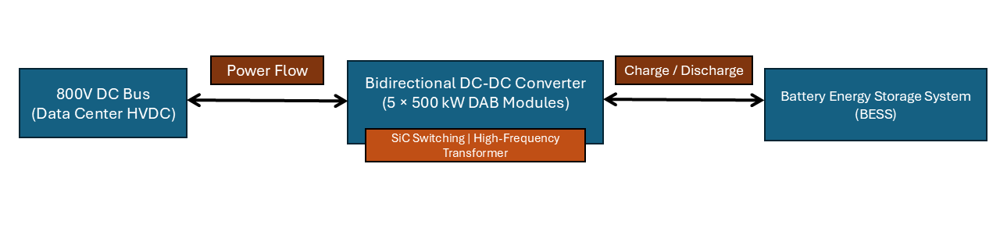
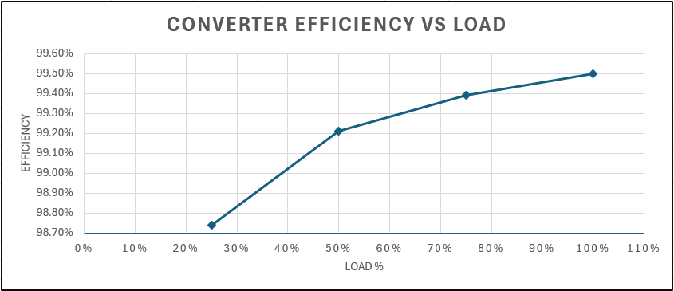

# 800V BESS DC-DC Converter for Data Centers

## Overview

This project presents a high-efficiency, bidirectional DC-DC converter designed to integrate a Battery Energy Storage System (BESS) directly into an 800 V DC data center power architecture.

Modern AI data centers demand massive, dynamic power while minimizing energy losses. Traditional systems rely on multiple AC/DC conversion stages, reducing overall efficiency and increasing infrastructure complexity.

This design eliminates unnecessary conversion stages by enabling direct DC integration of energy storage, improving system efficiency and scalability.

---

## Problem Statement

Current data center power systems follow this chain:

Grid (AC) → Transformer → Rectifier (AC→DC) → UPS → Inverter (DC→AC) → Server PSU (AC→DC)

This results in:
- Multiple conversion stages
- Increased energy losses
- Larger infrastructure footprint
- Limited integration of battery storage

---

## Proposed Solution

A bidirectional, isolated DC-DC converter connects:

- **800 V DC Bus (720–880 V range)**
- **High-voltage battery system (900–1100 V range)**

### Key Features

- Rated Power: **2.5 MW bidirectional**
- Modular Design: **5 × 500 kW DAB modules**
- Topology: **Dual Active Bridge (DAB)**
- Isolation: **High-frequency transformer**
- Semiconductor Technology: **SiC MOSFETs**
- Switching Frequency: **20 kHz**
- Cooling: **Liquid-cooled system**

This architecture enables:
- Direct DC battery integration
- Reduced conversion stages
- Bidirectional energy flow (charge/discharge)
- Improved efficiency and scalability

---

## System Architecture

---

## Design Assumptions

| Parameter | Value |
|----------|------|
| HVDC Bus Voltage | 800 V (720–880 V range) |
| Battery Voltage | 1000 V nominal (900–1100 V range) |
| Total Power | 2.5 MW |
| Module Count | 5 |
| Module Power | 500 kW |
| Topology | Dual Active Bridge |
| Semiconductor | SiC MOSFET |
| Switching Frequency | 20 kHz |
| Cooling | Liquid |
| Ambient Temperature | 40°C |

---

## Technical Design Choices

### Topology — Dual Active Bridge (DAB)
- Enables bidirectional power flow
- Provides galvanic isolation
- Supports high-power operation
- Allows soft-switching (ZVS) for improved efficiency

### Semiconductor Selection — SiC MOSFETs
- Lower switching losses than silicon
- Higher voltage capability
- Suitable for high-frequency operation
- Enables high efficiency at MW scale

### Magnetics Design
- High-frequency transformer for isolation and voltage matching
- Nanocrystalline core selected for high efficiency
- Losses include:
  - Core losses (hysteresis + eddy currents)
  - Copper losses (I²R)

### Control Strategy
- CC (Constant Current) — bulk charging
- CV (Constant Voltage) — end-of-charge protection
- CP (Constant Power) — grid/data center support
- Phase-shift control regulates bidirectional power flow

---

## Loss Breakdown

Losses were estimated across multiple operating points and include:

- Semiconductor conduction losses
- Switching losses
- Transformer copper losses
- Transformer core losses
- Filter losses
- Auxiliary losses

| Load | Total Loss | Efficiency |
|------|----------|-----------|
| 25%  | 8 kW     | 98.74%    |
| 50%  | 10 kW    | 99.21%    |
| 75%  | 11.5 kW  | 99.39%    |
| 100% | 12.5 kW  | 99.50%    |

---

## Efficiency Results

---

## Requirement Compliance

| Requirement | Target | Result | Status |
|------------|-------|--------|--------|
| Bus Voltage | 720–880 V | Supported | Pass |
| Rated Power | 2.5 MW bidirectional | Achieved | Pass |
| Isolation | Required | HF transformer | Pass |
| 100% Efficiency | ≥99.5% | 99.50% | Pass |
| 50–100% Efficiency | ≥99.0% | 99.21–99.50% | Pass |
| 25–50% Efficiency | ≥98.5% | 98.74–99.21% | Pass |
| Control Modes | CC/CV/CP | Implemented | Pass |
| Magnetics Design | Required | Included | Pass |
| Semiconductor Selection | Required | Included | Pass |

---

## Thermal Considerations

- Ambient temperature: 40°C
- Maximum junction temperature: 125°C
- Maximum magnetics hotspot: 120°C
- Total losses at full load: ~12.5 kW
- Per-module loss: ~2.5 kW

Liquid cooling is assumed to maintain thermal limits.

---

## Fault Handling (Conceptual)

| Fault Condition | Response |
|---------------|--------|
| Battery short | Isolate battery and shut down |
| Bus short | Disconnect converter |
| Overvoltage | Limit or shut down |
| Undervoltage | Limit operation |
| BMS communication loss | Safe shutdown |
| Overtemperature | Reduce power or trip |

---

## Key Insights

- Eliminating AC/DC conversion stages significantly improves efficiency
- Modular architecture improves scalability and thermal performance
- SiC-based DAB converters are strong candidates for MW-scale DC systems
- Achieving ≥99.5% efficiency at 2.5 MW is feasible with careful design

---

## Repository Structure
